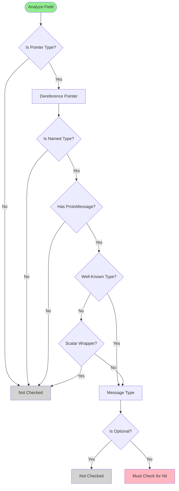
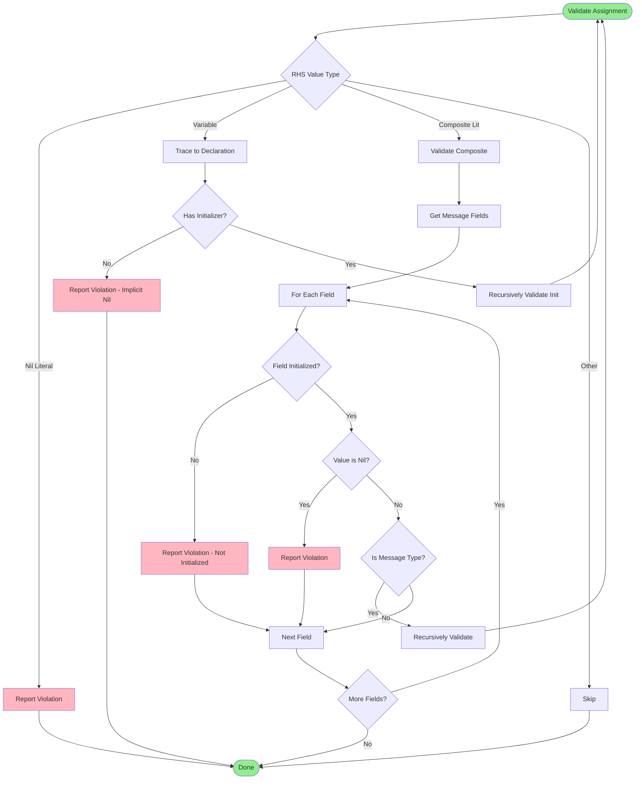
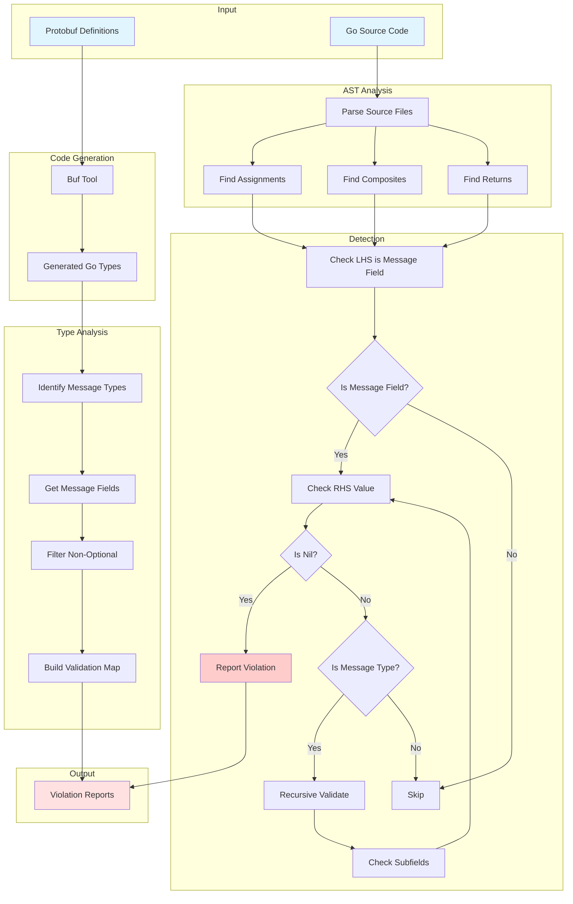

# Go Nil Linter Architecture Plan

## Overview

This linter detects nil assignments (both explicit and implicit) to **non-optional custom message fields** in protobuf-generated Go code. It focuses exclusively on message types (custom messages and Google well-known types), not scalar types, and recursively validates all submessages.

## Scope Clarification

### What We CHECK (Message Types)

✅ **Custom message types:**
```protobuf
message Address {
  string street = 1;
  Location location = 2;  // Nested message
}

message UserResponse {
  Address address = 1;           // ← CHECK this
  google.protobuf.Timestamp ts = 2;  // ← CHECK this
  google.type.Date date = 3;     // ← CHECK this
}
```

### What We IGNORE (Scalar Types)

❌ **Scalar types** (string, int32, bool, bytes, etc.):
```protobuf
message UserResponse {
  string name = 1;        // ← IGNORE
  int32 age = 2;          // ← IGNORE
  bool active = 3;        // ← IGNORE
  repeated string tags = 4;  // ← IGNORE
}
```

### Recursive Checking

When a message variable is assigned to a response field, we recursively check all its message-type subfields:

```go
// Example that should trigger multiple violations:
addr := &Address{
    Street: "",           // OK - scalar field
    Location: nil,        // VIOLATION - message field is nil
}
response.Address = addr   // OK - addr itself is not nil, but...
                         // we need to check addr.Location
```

## Project Structure

```
go_no_nil_linter/
├── go.mod
├── go.sum
├── README.md
├── ARCHITECTURE.md
├── proto/                          # Protobuf definitions
│   ├── buf.yaml
│   ├── buf.gen.yaml
│   └── example/
│       └── v1/
│           └── service.proto       # Example with nested messages
├── gen/                            # Generated Go code
│   └── example/
│       └── v1/
│           └── service.pb.go
├── analyzer/                       # Core analyzer
│   ├── analyzer.go                 # Main analyzer logic
│   ├── detector.go                 # Nil assignment detection
│   ├── messages.go                 # Message type identification
│   ├── recursive.go                # Recursive message validation
│   └── analyzer_test.go
├── cmd/
│   └── nonillinter/
│       └── main.go
└── testdata/
    ├── valid/
    │   └── src/
    │       └── a/
    │           └── a.go
    └── invalid/
        └── src/
            └── a/
                └── a.go
```

## Component Design

### 1. Example Protobuf Structure (proto/example/v1/service.proto)

```protobuf
syntax = "proto3";

package example.v1;

import "google/protobuf/timestamp.proto";
import "google/type/date.proto";

message Location {
  double latitude = 1;
  double longitude = 2;
}

message Address {
  string street = 1;                    // Scalar - not checked
  string city = 2;                      // Scalar - not checked
  Location location = 3;                // Message - CHECKED
}

message User {
  string id = 1;                        // Scalar - not checked
  string name = 2;                      // Scalar - not checked
  Address address = 3;                  // Message - CHECKED
  google.protobuf.Timestamp created_at = 4;  // Message - CHECKED
}

message UserResponse {
  User user = 1;                        // Message - CHECKED (recursive)
  google.type.Date last_login = 2;      // Message - CHECKED
  repeated User related_users = 3;      // Repeated messages - CHECKED
}

service UserService {
  rpc GetUser(GetUserRequest) returns (UserResponse);
}

message GetUserRequest {
  string user_id = 1;
}
```

### 2. Message Type Identification (analyzer/messages.go)

**Core Functions:**

```go
// isProtobufMessage checks if a type is a protobuf message type
func isProtobufMessage(t types.Type) bool {
    // Check for ProtoMessage() method
    // Exclude scalar types
}

// isMessageField checks if a struct field is a message type (not scalar)
func isMessageField(field *types.Var) bool {
    // Returns true for:
    // - Custom message types
    // - Google well-known types (google.protobuf.*, google.type.*)
    // Returns false for:
    // - string, int32, bool, etc.
    // - []byte
    // - repeated scalars ([]string, []int32, etc.)
}

// isOptionalField checks if field has 'optional' keyword
func isOptionalField(field *types.Var) bool {
    // Parse struct tags for "proto3_presence" or "oneof"
}

// getMessageFields returns all non-optional message fields
func getMessageFields(t types.Type) []*types.Var {
    // Filter struct fields:
    // 1. Must be message type (not scalar)
    // 2. Must not be optional
    // 3. Includes nested messages
}

// isWellKnownType checks for Google well-known types
func isWellKnownType(typeName string) bool {
    // Check against:
    // - google.protobuf.Timestamp
    // - google.protobuf.Duration
    // - google.type.Date
    // - google.type.Money
    // - etc.
}
```

**Detection Logic:**

```go
func isMessageField(field *types.Var) bool {
    fieldType := field.Type()
    
    // Dereference pointer if needed
    if ptr, ok := fieldType.(*types.Pointer); ok {
        fieldType = ptr.Elem()
    }
    
    // Check if it's a named type
    named, ok := fieldType.(*types.Named)
    if !ok {
        return false
    }
    
    // Must have ProtoMessage() method
    if !hasProtoMessageMethod(named) {
        return false
    }
    
    // Get package and type name
    pkg := named.Obj().Pkg()
    typeName := named.Obj().Name()
    
    // Check if it's a well-known type
    if pkg != nil && strings.HasPrefix(pkg.Path(), "google.golang.org/protobuf/types/known") {
        return true
    }
    
    if pkg != nil && strings.HasPrefix(pkg.Path(), "google.golang.org/genproto/googleapis/type") {
        return true
    }
    
    // Check if it's NOT a scalar wrapper
    // (StringValue, Int32Value, etc. are optional by nature)
    scalarWrappers := map[string]bool{
        "StringValue": true,
        "Int32Value": true,
        "Int64Value": true,
        "BoolValue": true,
        "BytesValue": true,
        "FloatValue": true,
        "DoubleValue": true,
    }
    
    if scalarWrappers[typeName] {
        return false // These are scalar wrappers, not real messages
    }
    
    // It's a message type
    return true
}
```

### 3. Nil Assignment Detection (analyzer/detector.go)

**Detection Patterns:**

1. **Direct nil assignment to message field:**
```go
response.User = nil                    // VIOLATION
response.User.Address = nil            // VIOLATION
```

2. **Implicit nil assignment (nil variable):**
```go
var user *User                         // user is nil
response.User = user                   // VIOLATION
```

3. **Nil in composite literal:**
```go
return &UserResponse{
    User: nil,                         // VIOLATION
    LastLogin: nil,                    // VIOLATION
}
```

4. **Assignment of struct with nil message fields:**
```go
user := &User{
    Id: "123",
    Name: "John",
    Address: nil,                      // VIOLATION (detected recursively)
}
response.User = user                   // Triggers recursive check
```

**Key Functions:**

```go
// detectAssignment checks an assignment statement
func detectAssignment(assign *ast.AssignStmt, pass *analysis.Pass) {
    for i, lhs := range assign.Lhs {
        rhs := assign.Rhs[i]
        
        // Check if LHS is a message field
        if !isMessageFieldAccess(lhs, pass) {
            continue
        }
        
        // Check if RHS is nil (explicit or implicit)
        if isNilValue(rhs, pass) {
            reportViolation(pass, rhs.Pos(), lhs)
            continue
        }
        
        // If RHS is a variable or composite, recursively validate
        if shouldRecursivelyValidate(rhs, pass) {
            validateMessageValue(rhs, pass)
        }
    }
}

// isMessageFieldAccess checks if expr is accessing a message field
func isMessageFieldAccess(expr ast.Expr, pass *analysis.Pass) bool {
    selector, ok := expr.(*ast.SelectorExpr)
    if !ok {
        return false
    }
    
    // Get type of the base expression
    baseType := pass.TypesInfo.TypeOf(selector.X)
    
    // Get the field being accessed
    field := getField(baseType, selector.Sel.Name, pass)
    if field == nil {
        return false
    }
    
    // Check if field is a message type
    return isMessageField(field)
}
```

### 4. Recursive Validation (analyzer/recursive.go)

**Purpose:** When a message variable is assigned to a response field, recursively check all its message-type subfields for nil values.

**Algorithm:**

```go
// validateMessageValue recursively validates a message value
func validateMessageValue(expr ast.Expr, pass *analysis.Pass) {
    switch e := expr.(type) {
    case *ast.Ident:
        // Variable assignment - trace to declaration
        validateVariable(e, pass)
        
    case *ast.CompositeLit:
        // Struct literal - check each field
        validateCompositeLit(e, pass)
        
    case *ast.CallExpr:
        // Function call - try to analyze return value
        validateFunctionCall(e, pass)
        
    case *ast.UnaryExpr:
        // Address operation (&expr)
        if e.Op == token.AND {
            validateMessageValue(e.X, pass)
        }
    }
}

// validateCompositeLit checks a composite literal
func validateCompositeLit(lit *ast.CompositeLit, pass *analysis.Pass) {
    structType := pass.TypesInfo.TypeOf(lit)
    
    // Get all message fields for this type
    messageFields := getMessageFields(structType)
    
    // Track which fields are initialized
    initialized := make(map[string]bool)
    
    for _, elt := range lit.Elts {
        kv, ok := elt.(*ast.KeyValueExpr)
        if !ok {
            continue
        }
        
        fieldName := kv.Key.(*ast.Ident).Name
        initialized[fieldName] = true
        
        // Check if value is nil
        if isNilValue(kv.Value, pass) {
            if isMessageFieldByName(structType, fieldName, pass) {
                reportViolation(pass, kv.Value.Pos(), fieldName)
            }
        } else {
            // Recursively validate non-nil message values
            validateMessageValue(kv.Value, pass)
        }
    }
    
    // Check for uninitialized message fields (implicit nil)
    for _, field := range messageFields {
        if !initialized[field.Name()] && !isOptionalField(field) {
            reportViolation(pass, lit.Pos(), field.Name())
        }
    }
}

// validateVariable traces a variable to its initialization
func validateVariable(ident *ast.Ident, pass *analysis.Pass) {
    obj := pass.TypesInfo.ObjectOf(ident)
    if obj == nil {
        return
    }
    
    // Find variable declaration
    var decl *ast.ValueSpec
    for _, file := range pass.Files {
        ast.Inspect(file, func(n ast.Node) bool {
            if vs, ok := n.(*ast.ValueSpec); ok {
                for _, name := range vs.Names {
                    if name.Name == ident.Name {
                        decl = vs
                        return false
                    }
                }
            }
            return true
        })
    }
    
    if decl == nil || len(decl.Values) == 0 {
        // No initializer - check if it's a zero value
        if isMessageType(obj.Type()) {
            reportViolation(pass, ident.Pos(), ident.Name)
        }
        return
    }
    
    // Recursively validate the initializer
    for _, value := range decl.Values {
        validateMessageValue(value, pass)
    }
}
```

**Recursive Validation Example:**

```go
// Input code:
addr := &Address{
    Street: "123 Main St",     // Scalar - OK
    Location: nil,             // Message - VIOLATION
}

user := &User{
    Id: "user-1",              // Scalar - OK
    Name: "John",              // Scalar - OK
    Address: addr,             // Message - OK (not nil), but...
                               // triggers recursive check of addr
}

response.User = user           // Triggers recursive check of user
```

**Validation Flow:**
```
1. Detect: response.User = user
2. User is not nil, but it's a message type
3. Recursively validate user:
   - user.Id: scalar, skip
   - user.Name: scalar, skip
   - user.Address: message, validate
4. Recursively validate addr:
   - addr.Street: scalar, skip
   - addr.Location: nil → VIOLATION!
```

### 5. Main Analyzer (analyzer/analyzer.go)

**Analyzer Definition:**

```go
var Analyzer = &analysis.Analyzer{
    Name: "nonillinter",
    Doc:  "detects nil assignments to non-optional protobuf message fields",
    Run:  run,
    Requires: []*analysis.Analyzer{
        inspect.Analyzer,
    },
}

func run(pass *analysis.Pass) (interface{}, error) {
    inspect := pass.ResultOf[inspect.Analyzer].(*inspector.Inspector)
    
    // Node types we care about
    nodeFilter := []ast.Node{
        (*ast.AssignStmt)(nil),      // Assignments
        (*ast.ReturnStmt)(nil),      // Return statements
        (*ast.CompositeLit)(nil),    // Struct literals
    }
    
    inspect.Preorder(nodeFilter, func(n ast.Node) {
        switch stmt := n.(type) {
        case *ast.AssignStmt:
            detectAssignment(stmt, pass)
            
        case *ast.ReturnStmt:
            for _, result := range stmt.Results {
                if shouldValidate(result, pass) {
                    validateMessageValue(result, pass)
                }
            }
            
        case *ast.CompositeLit:
            // Only validate if it's a response message type
            if isResponseMessage(pass.TypesInfo.TypeOf(stmt), pass) {
                validateCompositeLit(stmt, pass)
            }
        }
    })
    
    return nil, nil
}
```

## Detection Algorithm

### Phase 1: Identify Message Types

```
For each type in package:
  If type has ProtoMessage() method:
    Get all fields
    For each field:
      If field type is custom message (not scalar):
        If field is not optional:
          Mark as "must not be nil"
          Store in validation map
```

### Phase 2: Detect Nil Assignments

```
For each assignment in code:
  If LHS is a message field:
    If RHS is nil:
      Report violation
    Else if RHS is identifier or composite:
      Recursively validate RHS
```

### Phase 3: Recursive Validation

```
Function validateMessage(value):
  If value is nil:
    Report violation
    Return
  
  If value is composite literal:
    For each message field in type:
      If field value is nil:
        Report violation
      Else:
        Recursively validateMessage(field value)
    
    For each uninitialized message field:
      Report violation (implicit nil)
  
  If value is variable:
    Find variable declaration
    Recursively validateMessage(initializer)
```

## Example Violations

### Example 1: Direct Nil Assignment

```go
// VIOLATION: Direct nil assignment to message field
response := &UserResponse{}
response.User = nil  // ← ERROR: nil assignment to non-optional message field 'User'
```

### Example 2: Implicit Nil Assignment

```go
// VIOLATION: Implicit nil via uninitialized variable
var user *User  // user is nil
response := &UserResponse{
    User: user,  // ← ERROR: nil assignment to non-optional message field 'User'
}
```

### Example 3: Nested Message Nil

```go
// VIOLATION: Nil in nested message
user := &User{
    Id: "123",
    Name: "John",
    Address: nil,  // ← ERROR: nil assignment to non-optional message field 'Address'
}
response := &UserResponse{
    User: user,  // OK: user itself is not nil
                // But triggers recursive check that finds Address is nil
}
```

### Example 4: Deep Nesting

```go
// VIOLATION: Nil deep in nested structure
location := &Location{
    Latitude: 0.0,
    Longitude: 0.0,
}

addr := &Address{
    Street: "123 Main",
    City: "NYC",
    Location: location,  // OK
}

user := &User{
    Id: "123",
    Name: "John",
    Address: addr,       // OK
}

// Later in code...
addr.Location = nil      // ← ERROR: nil assignment to non-optional message field 'Location'
```

### Example 5: Uninitialized Message Field

```go
// VIOLATION: Message field not initialized (implicit nil)
user := &User{
    Id: "123",
    Name: "John",
    // Address not initialized → implicit nil
    // ← ERROR: non-optional message field 'Address' not initialized
}
```

## Valid Code Examples

### Example 1: All Message Fields Initialized

```go
// VALID: All message fields properly initialized
response := &UserResponse{
    User: &User{
        Id: "123",
        Name: "John",
        Address: &Address{
            Street: "123 Main",
            City: "NYC",
            Location: &Location{
                Latitude: 40.7128,
                Longitude: -74.0060,
            },
        },
        CreatedAt: timestamppb.Now(),
    },
    LastLogin: &date.Date{
        Year: 2024,
        Month: 1,
        Day: 15,
    },
}
```

### Example 2: Optional Fields Can Be Nil

```go
message UserResponse {
  User user = 1;
  optional Address alternate_address = 2;  // Optional field
}

// VALID: Optional message fields can be nil
response := &UserResponse{
    User: &User{...},
    AlternateAddress: nil,  // OK: optional field
}
```

### Example 3: Scalar Fields Don't Matter

```go
// VALID: Scalar fields can be empty/zero
user := &User{
    Id: "",           // OK: scalar
    Name: "",         // OK: scalar
    Address: &Address{...},  // Message must be non-nil
}
```

## Error Messages

**Format:**
```
<file>:<line>:<col>: nil assignment to non-optional message field '<field>' in protobuf message '<type>'
```

**Examples:**

```
user_handler.go:15:2: nil assignment to non-optional message field 'User' in protobuf message 'UserResponse'

user_handler.go:23:5: nil assignment to non-optional message field 'Address' in protobuf message 'User'

user_handler.go:30:3: non-optional message field 'Location' not initialized in protobuf message 'Address'
```

## Mermaid Diagrams

### Message Type Detection



### Recursive Validation Flow



### Complete Analysis Flow



## Implementation Phases

### Phase 1: Foundation
- Set up Go module and project structure
- Create protobuf definitions with nested messages
- Configure buf for code generation
- Generate initial Go code

### Phase 2: Core Detection
- Implement message type identification
- Detect direct nil assignments
- Basic violation reporting

### Phase 3: Implicit Nil Detection
- Track variable declarations
- Detect implicit nil through uninitialized variables
- Handle composite literals

### Phase 4: Recursive Validation
- Implement recursive message field checking
- Handle nested message structures
- Track initialization state

### Phase 5: Testing & Polish
- Comprehensive test cases
- Performance optimization
- Documentation
- CLI tool

## Performance Considerations

**Optimization Strategies:**

1. **Cache message type information** to avoid repeated reflection
2. **Limit recursion depth** to prevent infinite loops in circular references
3. **Prune search space** by only analyzing functions that use response types
4. **Lazy evaluation** of message fields

**Expected Performance:**
- Analysis time: < 2s for typical packages
- Memory usage: < 200MB
- Handles deep nesting (up to 10 levels)

## Summary

This architecture focuses on detecting nil assignments specifically to **custom message fields** in protobuf types, with **full recursive validation** of nested message structures. The linter ignores scalar types and focuses on the structural integrity of message objects, ensuring that all required message-type fields are properly initialized throughout the object graph.